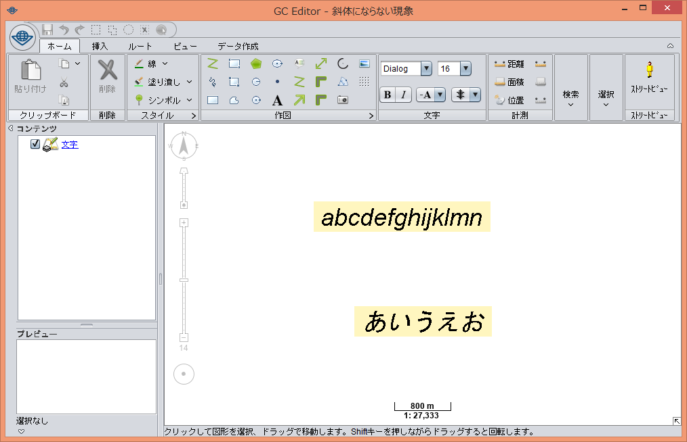

# GC Runtime
株式会社Informatixの製品「GeoConic」「GC Server」等の動作を保証するランタイムです。  
AdoptOpenJDKのソース([8u222_b10](https://github.com/AdoptOpenJDK/openjdk-jdk8u/tree/jdk8u222-b10))を取得し、修正を加えたものを公開しています。

## 修正済の不具合
- 「ＭＳ ゴシック」等で表示した文字に斜体を適用しても反映されない。  
修正前  
  
修正後  
  

- 高解像度の端末において一部の弊社製品を起動すると、文字やボタンが極端に小さく表示されてレイアウトが崩れる。  
修正前  
  
修正後  
